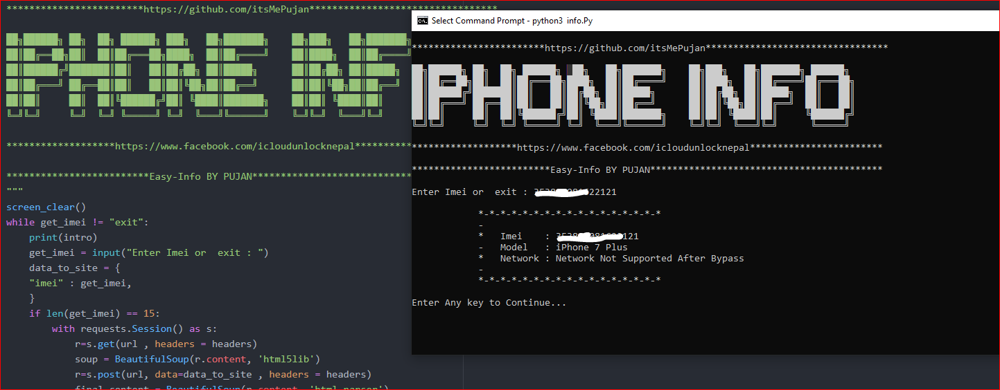

# Info.Py help you to find your iphone information 
 
# How to use 
1. Download the file Info.py or Clone to Desktop 
2. Open CMD and type python3 and drage the file. 
3. Hit Enter. 

# Requirement 
1. Python must be installed on device
2. Internet Connection 

# will be added soon 
1. Find my Iphone info 

# ScreenShot 

